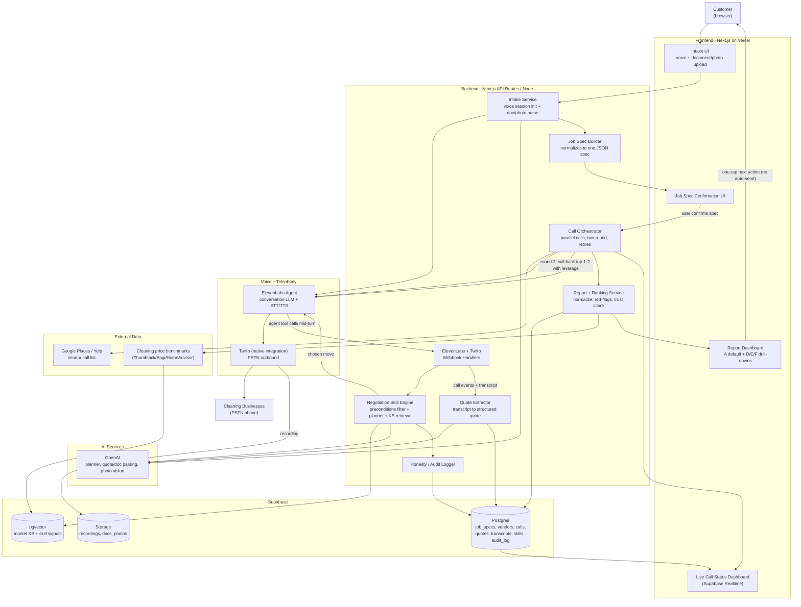
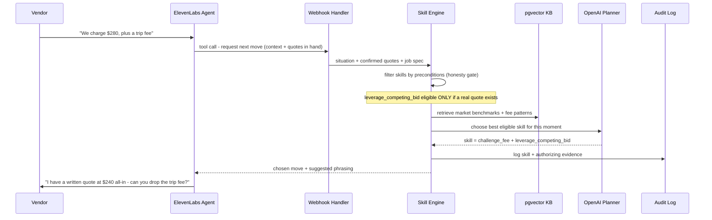
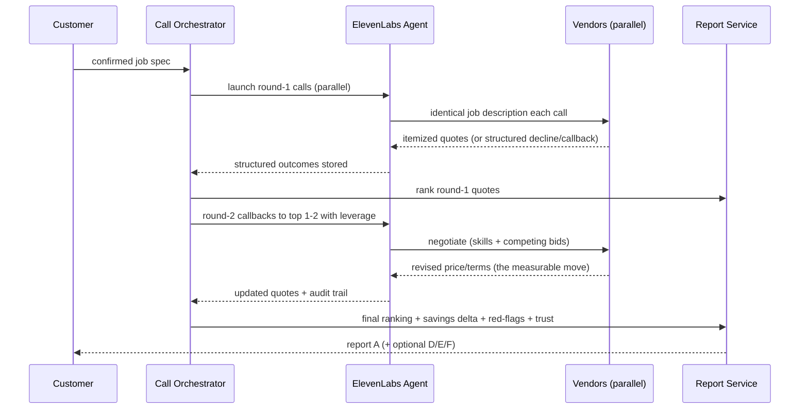
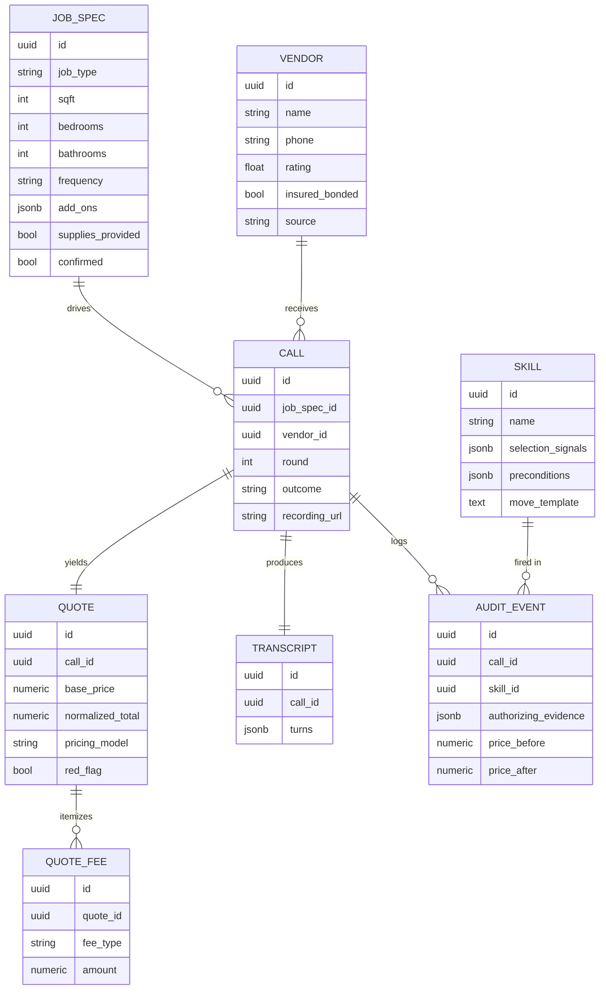
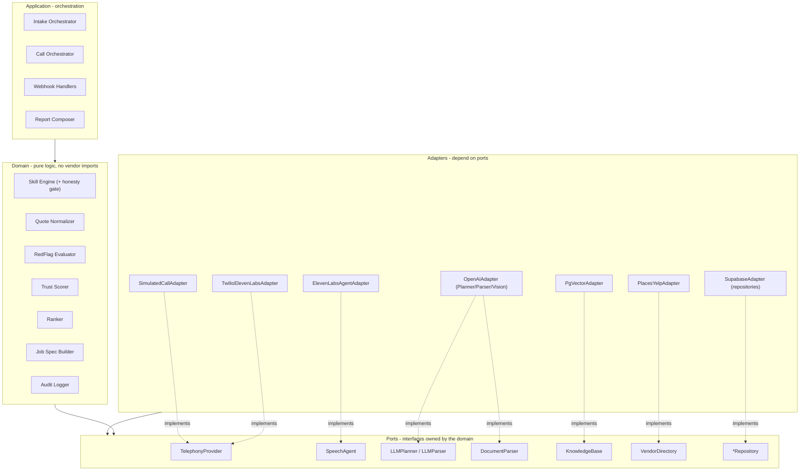

# The Negotiator — Architecture & Tech Stack

**Challenge:** C1 · The Negotiator (ElevenLabs × Hack-Nation)
**Date:** 2026-07-18
**Feature spec:** [2026-07-18-the-negotiator-feature-spec.md](2026-07-18-the-negotiator-feature-spec.md)
**Standalone diagram:** [the-negotiator-architecture.mmd](../architecture/the-negotiator-architecture.mmd)

---

## 1. Tech stack (decided)

| Layer | Choice | Notes |
|-------|--------|-------|
| Frontend | **Next.js (TypeScript / React)** | Intake, confirmation, live status, report. Lovable/Emdash/WOZ accelerate UI |
| Backend | **Next.js API routes / Node (TypeScript)** | Single language across the stack; first-class ElevenLabs + Twilio SDKs |
| Voice + telephony | **ElevenLabs Agents + native Twilio integration** | Agent tools/webhooks; minimal media/TwiML plumbing |
| AI (planner/parse/vision) | **OpenAI (GPT-4o-class)** | Skill planner, quote/doc parsing, room-photo vision. ElevenLabs built-in LLM drives the live call |
| Data + KB + files | **Supabase** | Postgres (relational) + pgvector (KB + skill signals) + Storage (recordings/docs/photos) + Realtime |
| Deployment | **Vercel + Supabase** | Next.js API routes handle ElevenLabs/Twilio webhooks; Supabase Realtime pushes live call status |

**Architectural principle:** the system is **event-driven** so it fits serverless. The Call Orchestrator does not hold a long-running process; call progress advances through ElevenLabs/Twilio webhook events, and state lives in Supabase. This keeps everything on Vercel functions without a separate always-on worker.

**Design style (pragmatic hexagonal):** the **domain** (the parts that win the challenge — skill selection, honesty gate, quote normalization, ranking) depends only on **ports** (narrow TypeScript interfaces). Concrete vendors (OpenAI, ElevenLabs, Twilio, Supabase, Google Places) are **adapters** behind those ports. We invert dependencies **only at the four volatile boundaries** — telephony, LLM, persistence, and document parsing — and keep everything else concrete, so we get SOLID where it pays off (testing, provider-swap, demo fakes) without over-engineering an 8-hour build. See §8 for the SOLID rationale and module-dependency diagram.

---

## 2. System architecture (container view)

---

## 3. Components (what / how used / depends on)

Components are grouped by layer. **Domain** components hold logic and depend only on **ports** (§8). **Application** components orchestrate. **Adapters** implement ports against concrete vendors. Responsibilities are split so each component has one reason to change (SRP).

### Application / orchestration
- **Intake Orchestrator** — runs the intake journey: starts the voice interview (via `SpeechAgent` port), hands uploads to the Document Parser, forwards results to the Job Spec Builder. *One job: sequence intake.* Depends on: `SpeechAgent`, Document Parser, Job Spec Builder.
- **Call Orchestrator** — launches parallel round-1 calls, tracks state, triggers round-2 callbacks to the top 1–2 with leverage, handles retries. Event-driven via webhooks. *Call-list sourcing extracted to Vendor Discovery.* Depends on: `TelephonyProvider`, Vendor Discovery, `CallRepository`.
- **Webhook Handlers** — receive ElevenLabs agent tool calls (mid-turn) and Twilio/ElevenLabs lifecycle events; translate them into domain calls (Skill Engine, Quote Extractor). *One job: adapt inbound events → domain.*

### Domain (logic; depends only on ports)
- **Job Spec Builder** — normalizes voice + document outputs into one canonical **job spec JSON** (schema in §6). Depends on: `JobSpecRepository`.
- **Negotiation Skill Engine** — the differentiator. `preconditions filter → KB retrieval → planner picks the move`, returns the chosen skill and emits an audit event. Depends on: `KnowledgeBase`, `LLMPlanner`, Audit Logger. The **preconditions filter** is a pure function (deterministic honesty gate) — trivially unit-testable.
- **Quote Extractor** — converts a call transcript into a structured quote (fees itemized). Depends on: `LLMParser`, `QuoteRepository`.
- **Vendor Discovery** — produces the call list for a job/geo. Depends on: `VendorDirectory` port (Places/Yelp behind it).
- **Report assembly (SRP split from the old "Report + Ranking Service"):**
  - **Quote Normalizer** — maps heterogeneous pricing models (flat / hourly-with-minimum / per-sqft) to one comparable total. Pure function.
  - **RedFlag Evaluator** — applies config red-flag rules (>30% below market, etc.) against benchmarks. Pure function over rules.
  - **Trust Scorer** — blends insured/bonded, guarantee, review volume into a trust signal. Pure function.
  - **Ranker** — orders quotes and selects the recommended deal. Pure function.
  - **Report Composer** — assembles primary output A + optional drill-downs D/E/F from the four above. Depends on: `QuoteRepository`, `KnowledgeBase` (benchmarks).
- **Honesty / Audit Logger** — records every skill fired, its authorizing evidence, and each price/term change. Depends on: `AuditRepository`.

### Adapters (implement ports; the only code that knows a vendor's name)
- `TelephonyProvider` → **TwilioElevenLabsAdapter** (real) / **SimulatedCallAdapter** (golden/demo)
- `SpeechAgent` → **ElevenLabsAgentAdapter**
- `LLMPlanner` / `LLMParser` → **OpenAIAdapter**
- `DocumentParser` → **OpenAIVisionAdapter** (quote docs + room photos)
- `KnowledgeBase` → **PgVectorAdapter**
- `*Repository` (JobSpec/Call/Quote/Audit) → **SupabaseAdapter**
- `VendorDirectory` → **PlacesYelpAdapter**

---

## 4. Mid-call skill loop (the honesty gate lives here)

**Why this matters for judging:** dishonest moves are *structurally impossible* — the Skill Engine cannot return `leverage_competing_bid` unless a real competing quote row exists. The audit log is the artifact we show judges.

---

## 5. Two-round negotiation flow

---

## 6. Data model

The **market-research knowledge base** (benchmarks, fee patterns, red-flag thresholds) and **skill selection signals** are embedded into **pgvector** for retrieval; the `SKILL` rows hold the structured definitions.

---

## 7. Deployment & realtime

- **Vercel**: Next.js app + API route handlers for ElevenLabs/Twilio webhooks (`/api/webhooks/elevenlabs`, `/api/webhooks/twilio`) and app APIs.
- **Supabase**: Postgres + pgvector + Storage; **Realtime** channel streams `CALL` status/outcome changes to the Live Call Status Dashboard.
- **Config-not-code**: `verticals/home_cleaning.json` (job-spec taxonomy, benchmarks, red-flag rules) + seeded `SKILL` rows. Swapping vertical = swapping config + skills, no code changes.
- **Demo resilience**: golden pre-recorded calls served from Storage as the backbone; one live call on stage; webhooks via the deployed Vercel endpoints (no ngrok needed).

---

## 8. SOLID rationale, ports & module dependencies

### Ports (the abstraction seam)
Domain code imports these interfaces; adapters implement them. Swapping a provider (or faking it for a test/demo) means writing a new adapter, never editing the domain.

| Port | Purpose | Adapter(s) |
|------|---------|-----------|
| `TelephonyProvider` | place/manage outbound calls | TwilioElevenLabs · **SimulatedCall** (demo/golden) |
| `SpeechAgent` | run the voice conversation (intake + calls) | ElevenLabsAgent |
| `LLMPlanner` | choose a skill given eligible set + context | OpenAI |
| `LLMParser` | transcript/doc → structured data | OpenAI (+ Vision) |
| `DocumentParser` | quote docs / room photos → job-spec fields | OpenAIVision |
| `KnowledgeBase` | retrieve benchmarks + skill signals | PgVector |
| `VendorDirectory` | vendor call list for a job/geo | Places/Yelp |
| `JobSpecRepository` / `CallRepository` / `QuoteRepository` / `AuditRepository` | persistence | Supabase |

### How each principle is satisfied

- **SRP** — the old bundled services are split: Intake → *Intake Orchestrator* + *Document Parser*; Report → *Normalizer* + *RedFlag Evaluator* + *Trust Scorer* + *Ranker* + *Composer*; call-list sourcing → *Vendor Discovery*. Each has one reason to change.
- **OCP** — behavior grows via **data**, not code: skills are rows, verticals are config, red-flag rules are config. New skill / vertical / rule = no code change. New provider = new adapter, domain untouched.
- **LSP** — every adapter honors its port's contract, so `SimulatedCallAdapter` substitutes for `TwilioElevenLabsAdapter` with no domain changes — this is exactly what powers the golden-call demo backbone.
- **ISP** — ports are narrow and role-specific (`LLMPlanner` vs `LLMParser` are separate even though both hit OpenAI), so no consumer depends on methods it doesn't use.
- **DIP** — domain depends on ports (abstractions); adapters (details) depend on the ports too. Dependencies point **inward** toward the domain.

### Module-dependency diagram (dependencies point inward)

### Deliberately NOT abstracted (avoid over-engineering)
Realtime UI updates, Next.js routing, config-file loading, and the webhook transport are used concretely — they are not volatile and faking them buys nothing for an 8-hour build. SOLID is applied where it earns its keep.

---

## 9. Mapping to build tiers (from feature spec §8)

| Tier | Architecture surface to stand up |
|------|----------------------------------|
| **T1** | Intake Service + Job Spec Builder + Skill Engine + Quote Extractor + Report A + Audit Logger + Supabase schema |
| **T2** | Call Orchestrator with real Twilio calls + webhook handlers + Realtime status + drill-downs D/E/F |
| **T3** | Skill Generator, photo vision in Intake, email fallback path, assisted-call co-pilot |

---

## 10. Owner mapping (suggested)

- **Khaled (backend/data):** ports + Supabase/PgVector adapters, Skill Engine (+ honesty gate), Quote Extractor, webhooks, KB ingestion.
- **Abdu (frontend + logic):** Intake/confirmation/report UI; the pure-function domain logic (Normalizer, RedFlag Evaluator, Trust Scorer, Ranker) and skill selection rules.
- **Tarek (fullstack + demo):** ElevenLabs/Twilio + Simulated adapters, Intake/Call Orchestrators, deployment, golden-call capture, demo/materials.
