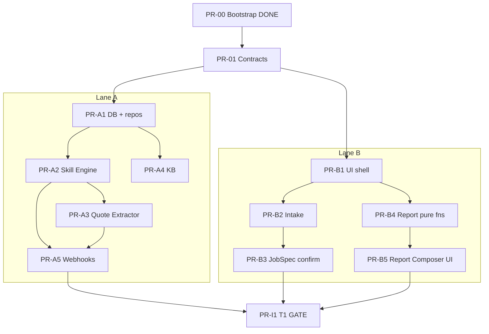

# The Negotiator Implementation Plan

> **For agentic workers:** REQUIRED SUB-SKILL: Use superpowers:subagent-driven-development (recommended) or superpowers:executing-plans to implement this plan task-by-task. Steps use checkbox (`- [ ]`) syntax for tracking. Execute **one work package (PR) at a time** from `docs/superpowers/plans/packages/`.

**Goal:** Ship a working T1 end-to-end Negotiator (home cleaning) with simulated telephony, then optionally T2 (real voice/calls) and T3 (wow features), via small test-driven PRs from two Codex machines.

**Architecture:** Pragmatic hexagonal — domain depends on ports in `src/contracts`; adapters implement ports; application orchestrates; frontend talks only to `/api/*`. See [architecture spec](../../specs/2026-07-18-the-negotiator-architecture.md) and [layer docs](../../architecture/layers/).

**Tech Stack:** Next.js 15 (TypeScript) · Vitest · Playwright · dependency-cruiser · Zod · Supabase · ElevenLabs · Twilio · OpenAI

## Global Constraints

- Vertical: `home_cleaning` only for MVP (`config/verticals/home_cleaning.json`).
- Comparability: one confirmed `JobSpec` per negotiation run.
- Honesty: skill preconditions structurally block fake competing bids; audit log required.
- CI: **no vendor secrets**; all CI tests use `src/adapters/fake/**`.
- Dependencies: `src/domain` imports only `src/contracts`; adapters never import domain; app imports adapters only from `src/app/composition/**`.
- Docs gate: changing `src/<layer>/**` requires updating `docs/architecture/layers/<layer>.md` (or `no-docs-needed` label).
- Branch naming: `lane-a/<PR-ID>-slug`, `lane-b/<PR-ID>-slug`, `integration/<PR-ID>-slug`.
- Two GitHub collaborator accounts push to **same** repo (`KhMorsy/The-Negotiator`); never force-push `main`.
- Local clones: avoid `#` in filesystem path (breaks Vite/Next).
- Clean code: YAGNI, SRP per file, no speculative abstractions, TDD (failing test first).
- Tier rule: finish **T1 gate (PR-I1)** before starting T2; finish **T2 gate (PR-I2)** before T3.

---

## Parallel lanes

| Lane | Machine / account | Owns | Must not edit without coordination |
|------|-------------------|------|-------------------------------------|
| **A** | Machine 1 | `src/domain/skills`, `src/domain/quotes`, `src/domain/audit`, `src/adapters/**`, `src/app/webhooks/**`, DB migrations | `src/frontend/**`, report UI |
| **B** | Machine 2 | `src/frontend/**`, `src/app/intake/**`, `src/app/report/**`, `src/domain/jobSpec`, `src/domain/report/**` | Real telephony adapters |
| **Shared** | Either, serialize | `src/contracts/**`, `config/verticals/**`, CI workflows | — open as dedicated contract PRs |

Meet only at: **PR-01 (contracts)**, **PR-I1 / I2 / I3 (integration)**.

---

## PR dependency graph



T2/T3 packages are listed in [packages/](packages/) and must not start until their gate predecessor merges.

---

## Canonical types (lock these names — do not rename across packages)

```typescript
export type JobType =
  | "recurring_weekly"
  | "recurring_biweekly"
  | "recurring_monthly"
  | "deep_clean"
  | "move_out"
  | "post_renovation"
  | "turnover";

export type PricingModel = "flat" | "hourly_with_minimum" | "per_sqft";

export type CallOutcome =
  | "itemized_quote"
  | "callback_commitment"
  | "documented_decline"
  | "voicemail"
  | "no_answer";

export type CallRound = 1 | 2;

export interface JobSpec {
  id: string;
  jobType: JobType;
  sqft: number;
  bedrooms: number;
  bathrooms: number;
  frequency: "once" | "weekly" | "biweekly" | "monthly";
  addOns: string[];
  suppliesProvided: boolean;
  pets: boolean;
  accessNotes: string;
  conditionNotes: string;
  geo: string;
  confirmed: boolean;
  leverageQuoteAmount?: number;
}

export interface Vendor {
  id: string;
  name: string;
  phone: string;
  rating: number;
  reviewCount: number;
  insuredBonded: boolean;
  hasGuarantee: boolean;
  source: "places" | "yelp" | "fake";
}

export interface QuoteFee {
  id: string;
  quoteId: string;
  feeType: string;
  amount: number;
}

export interface Quote {
  id: string;
  callId: string;
  jobSpecId: string;
  vendorId: string;
  basePrice: number;
  normalizedTotal: number;
  pricingModel: PricingModel;
  fees: QuoteFee[];
  redFlag: boolean;
  round: CallRound;
}

export interface SkillPreconditions {
  requiresCompetingQuote?: boolean;
  requiresRecurringJob?: boolean;
  minQuotesInHand?: number;
}

export interface Skill {
  id: string;
  name: string;
  selectionSignals: string[];
  preconditions: SkillPreconditions;
  moveTemplate: string;
}

export interface AuditEvent {
  id: string;
  callId: string;
  skillId: string;
  authorizingEvidence: Record<string, unknown>;
  priceBefore: number | null;
  priceAfter: number | null;
  createdAt: string;
}

export interface ReportPrimary {
  jobSpecId: string;
  rankedQuotes: Quote[];
  recommendedQuoteId: string;
  plainLanguageWhy: string;
}

export interface ReportDrilldowns {
  savings?: { initialTotal: number; negotiatedTotal: number; marketBenchmark: number };
  redFlags?: Array<{ quoteId: string; reasons: string[] }>;
  trust?: Array<{ vendorId: string; score: number }>;
}
```

Port method names are locked in [contracts.md](../../architecture/layers/contracts.md).

---

## Work package index

| ID | Tier | Lane | File | Depends on |
|----|------|------|------|------------|
| PR-00 | — | — | Bootstrap (this commit) | — |
| PR-01 | T1 | Shared | [PR-01-contracts.md](packages/PR-01-contracts.md) | PR-00 |
| PR-A1 | T1 | A | [PR-A1-db-repos.md](packages/PR-A1-db-repos.md) | PR-01 |
| PR-A2 | T1 | A | [PR-A2-skill-engine.md](packages/PR-A2-skill-engine.md) | PR-A1 |
| PR-A3 | T1 | A | [PR-A3-quote-extractor.md](packages/PR-A3-quote-extractor.md) | PR-A1 |
| PR-A4 | T1 | A | [PR-A4-knowledge-base.md](packages/PR-A4-knowledge-base.md) | PR-A1 |
| PR-A5 | T1 | A | [PR-A5-webhooks.md](packages/PR-A5-webhooks.md) | PR-A2, PR-A3 |
| PR-B1 | T1 | B | [PR-B1-ui-shell.md](packages/PR-B1-ui-shell.md) | PR-01 |
| PR-B2 | T1 | B | [PR-B2-intake.md](packages/PR-B2-intake.md) | PR-B1 |
| PR-B3 | T1 | B | [PR-B3-job-spec-confirm.md](packages/PR-B3-job-spec-confirm.md) | PR-B2 |
| PR-B4 | T1 | B | [PR-B4-report-pure.md](packages/PR-B4-report-pure.md) | PR-01 |
| PR-B5 | T1 | B | [PR-B5-report-composer-ui.md](packages/PR-B5-report-composer-ui.md) | PR-B4, PR-B1 |
| PR-I1 | T1 | Integration | [PR-I1-t1-integration.md](packages/PR-I1-t1-integration.md) | A5, B3, B5 |
| PR-A6 | T2 | A | [PR-A6-elevenlabs-speech.md](packages/PR-A6-elevenlabs-speech.md) | PR-I1 |
| PR-A7 | T2 | A | [PR-A7-twilio-orchestrator.md](packages/PR-A7-twilio-orchestrator.md) | PR-I1 |
| PR-B6 | T2 | B | [PR-B6-live-dashboard.md](packages/PR-B6-live-dashboard.md) | PR-I1 |
| PR-B7 | T2 | B | [PR-B7-drilldowns.md](packages/PR-B7-drilldowns.md) | PR-I1 |
| PR-I2 | T2 | Integration | [PR-I2-t2-integration.md](packages/PR-I2-t2-integration.md) | A7, B6, B7 |
| PR-A8 | T3 | A | [PR-A8-skill-generator.md](packages/PR-A8-skill-generator.md) | PR-I2 |
| PR-B8 | T3 | B | [PR-B8-room-photos.md](packages/PR-B8-room-photos.md) | PR-I2 |
| PR-A9 | T3 | A | [PR-A9-email-fallback.md](packages/PR-A9-email-fallback.md) | PR-I2 |
| PR-I3 | T3 | Integration | [PR-I3-t3-integration.md](packages/PR-I3-t3-integration.md) | A8, B8, A9 |

---

## CI / CD (both accounts)

Workflow: `.github/workflows/ci.yml`

1. `npm ci`
2. `npm run lint`
3. `npm run typecheck`
4. `npm run arch:check` (dependency-cruiser)
5. Docs freshness (`scripts/check-docs-freshness.mjs`)
6. `npm run test` (Vitest unit + contract + integration)
7. `npm run build`
8. Playwright e2e (simulated path)

**Secrets:** none required for CI. Optional live adapter tests use `RUN_LIVE_ADAPTER_TESTS=1` locally only.

**Branch protection (manual GitHub settings):** require `quality` job on `main`; dismiss stale reviews; no direct push preferred.

---

## Tier gates (executable)

### T1 gate (PR-I1)
Playwright e2e:
1. Create job via intake API (fake speech + fake doc parse)
2. Confirm job spec
3. Run round-1 simulated calls (≥3 negotiation styles)
4. Round-2 callback produces `priceAfter < priceBefore` on ≥1 audit event
5. Report page shows ranked quotes + recommendation + audit entry visible via API

### T2 gate (PR-I2)
- Real `SpeechAgent` adapter behind same port (intake)
- Real Twilio path selectable via env; simulated still default in CI
- Live dashboard updates call status
- Drill-downs D/E/F render when toggled

### T3 gate (PR-I3)
- Skill generator produces a valid `Skill` for an unseen ask (unit + 1 integration)
- Room-photo path fills partial JobSpec
- Email fallback records structured outcome without crashing call flow
- Assisted-call co-pilot mode stub wired behind feature flag

---

## How to execute a package

1. Pull `main`
2. `git checkout -b lane-a/PR-A2-skill-engine` (or lane-b / integration)
3. Open the package file; follow steps top to bottom (TDD)
4. Run `npm run ci` before opening PR
5. Fill PR template; request review from the other lane if contracts touched
6. Merge only when CI green

---

## Execution handoff

After packages are written, implement with:

1. **Subagent-Driven (recommended)** — fresh subagent per package + review between packages  
2. **Inline Execution** — executing-plans in one session with checkpoints
